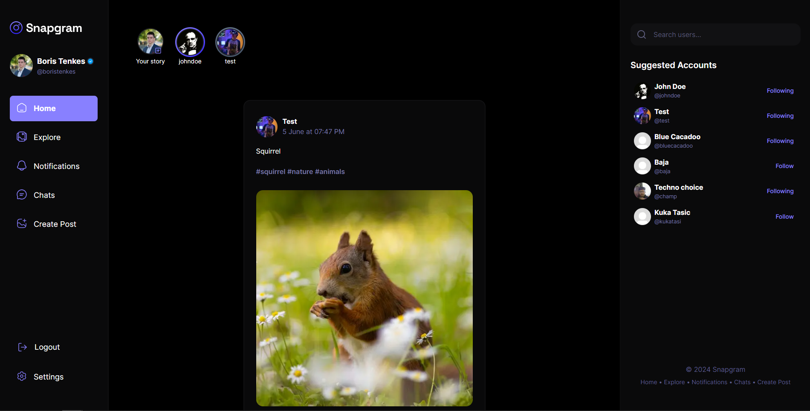
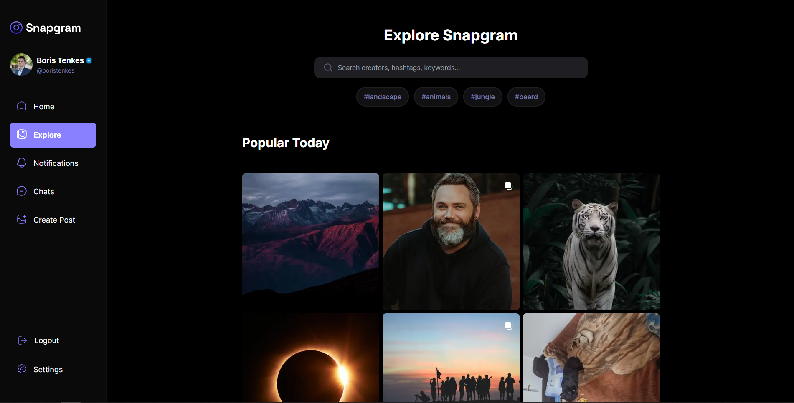
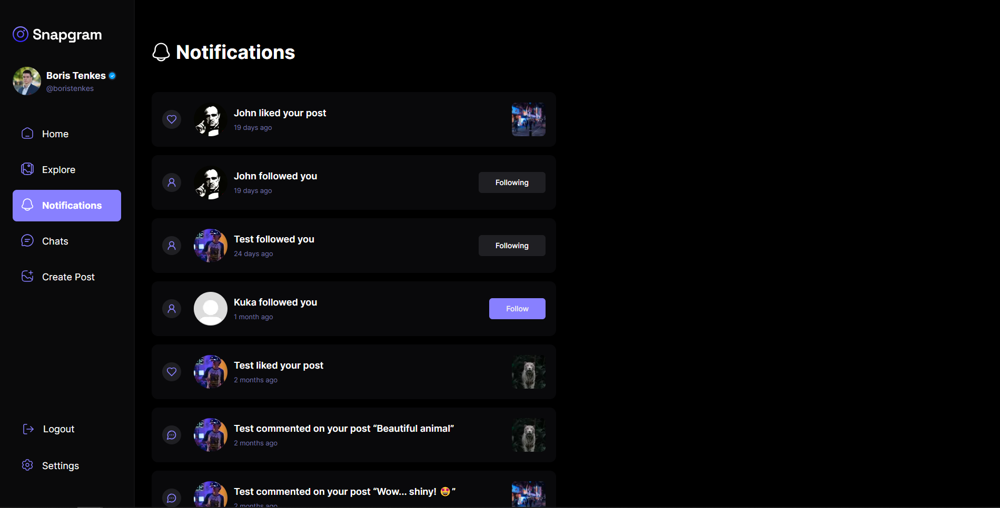
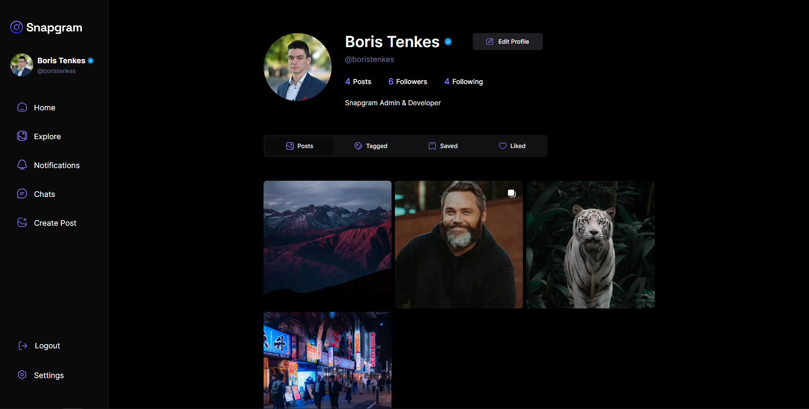
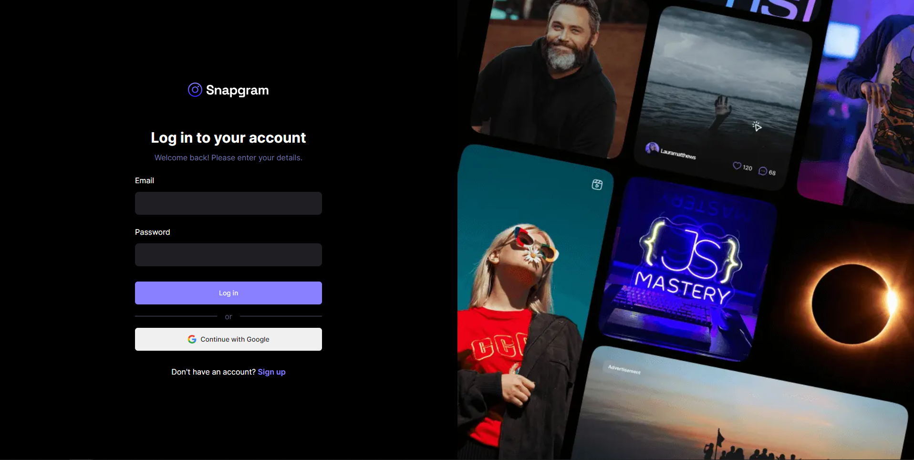

# Snapgram

Snapgram is a redesigned, fully functional Instagram clone built with Next.js. 
Design by: [JS Mastery](https://www.youtube.com/watch?v=_W3R2VwRyF4)

## Table of Contents

- [Snapgram](#snapgram)
  - [Table of Contents](#table-of-contents)
  - [Screenshots](#screenshots)
  - [Features](#features)
    - [Authentication](#authentication)
    - [Pages](#pages)
      - [Home page](#home-page)
      - [Explore page](#explore-page)
      - [Notifications page](#notifications-page)
      - [Profile page](#profile-page)
      - [Settings page](#settings-page)
  - [Built with](#built-with)
  - [Licence](#licence)
  - [Author](#author)

## Screenshots

Home page

Explore page

Notifications page

Profile page

Login page

## Features

### Authentication

- Uses [NextAuth](https://next-auth.js.org/) for authentication.
- Only authenticated users can access the app.
- Users can create an account using Google or through email and password.

### Pages

#### Home page

- Displays posts from people the user follows and their own posts.
- Shows a list of users to follow if the user doesn't follow anyone or have any posts.
- Stories from followed users are displayed above the post list.
- Each post includes the author, creation date, caption, tags, content, mentioned users, and comments.
- Posts can be liked, disliked, saved, commented on and edited or deleted by the owner.
- On desktop, a sidebar with a search bar and suggested accounts is displayed.

#### Explore page

- Displays a list of post cards the user can see (excluding private posts from users they don't follow).
- A search bar filters post cards by author, caption, or tags.
- Top 4 most popular tags are shown below the search bar.
- Clicking a post card opens it in a modal with a masked URL.
- If the page is reloaded with the modal open or the link is visited directly, it redirects to a separate post page where they can also see other posts posted by same author.

#### Notifications page

- Lists notifications for the user.
- Notifications are received for likes, comments, mentions, follows, and follow requests (for private accounts).
- Follow request notifications include "Accept" and "Delete" buttons.
- An indicator on the sidebar shows the number of unseen notifications.
- Unseen notifications are marked with a "new" badge.
- Each user is limited to 10 notifications. When this limit is exceeded, the oldest notification is deleted.

#### Profile page

- Displays the user's profile image, name, username, description, number of posts, followers, and following.
- Private accounts require following to see their posts.
- Users see an "Edit profile" button on their own profile.
- "Follow" and "Message" buttons are shown for other profiles.
- "Follow" button changes to "Following" or "Request sent" as appropriate.
- Users can view the followers and following lists if the profile is public or followed by them.
- Users can remove followers and unfollow users on their own profile.

#### Settings page

- Allows users to manage their accounts.
- Users can toggle profile privacy between public and private.
- Users can delete their profile.

## Built with

- [Next.js 14](https://nextjs.org)
- [Tailwind CSS](https://tailwindcss.com)
- [Typescript](https://www.typescriptlang.org)
- [MongoDB](https://mongodb.com)
- [mongoose](https://mongoosejs.com)
- [shadcn/ui](https://ui.shadcn.com)
- [uploadthing](https://uploadthing.com)
- [NextAuth](https://next-auth.js.org)
- [zod](https://zod.dev)
- [React Hook Form](https://react-hook-form.com)
- [React Dropzone](https://react-dropzone.js.org)
- [Vercel](https://vercel.com)

## Licence

This project is licensed under the MIT License - see the [LICENSE](LICENSE) file for details.

## Author

- [Portfolio](https://boristenkes.com)
- [GitHub](https://github.com/boristenkes)
